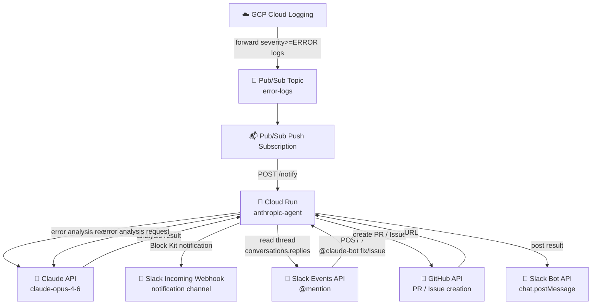

# anthropic-agent

A Cloud Run service that detects GCP error logs, analyzes them with Claude, and sends Slack notifications.
Responds to Slack @mentions to automatically create GitHub PRs and Issues.

## Endpoints

| Path | Purpose |
|------|---------|
| `POST /notify` | Receives Pub/Sub Push subscription messages |
| `POST /` | Receives Slack Events API events |

## Architecture



## Flow

### 1. Error Notification (Pub/Sub → Slack)

```
GCP Cloud Logging
  └─ detects severity>=ERROR log
  └─ forwards to Pub/Sub topic: error-logs
     └─ Push subscription calls POST /notify
        └─ resolves repository from REPO_MAP by service name
           └─ unregistered services are skipped (logged only)
        └─ analyzes error with Claude
        └─ sends Block Kit notification via Slack Webhook
           ├─ Project ID / GitHub repository link
           ├─ Service name
           ├─ View in Cloud Logging button
           └─ AI analysis result
```

### 2. Auto-create GitHub PR (`@claude-bot fix`)

```
Slack: @claude-bot fix
  └─ Slack Events API → POST /
     └─ fetch thread messages
        └─ analyze error with Claude (evaluate should_create_pr)
           └─ if should_create_pr=true
              └─ GitHub API: create branch → update file → create PR
                 └─ post link to Slack thread
```

### 3. Create GitHub Issue (`@claude-bot issue`)

```
Slack: @claude-bot issue
  └─ Slack Events API → POST /
     └─ fetch thread messages
        └─ analyze error with Claude
           └─ GitHub API: create Issue
              └─ post link to Slack thread
```

## Environment Variables

| Variable | Required | Description |
|----------|----------|-------------|
| `ANTHROPIC_API_KEY` | ✅ | Claude API key |
| `SLACK_WEBHOOK_URL` | ✅ | Incoming Webhook URL for error notifications |
| `SLACK_BOT_TOKEN` | ✅ | Slack Bot Token (`xoxb-...`) |
| `SLACK_SIGNING_SECRET` | recommended | Secret for verifying Slack request signatures |
| `GITHUB_TOKEN` | ✅ | GitHub Personal Access Token |
| `GITHUB_USER` | ✅ | GitHub owner name (e.g. `your-github-username`) |
| `REPO_MAP` | ✅ | Service name to repository mapping (e.g. `example-api=example,foo-svc=foo`) |
| `PROJECT_ID` | ✅ | GCP project ID |

## File Structure

```
services/anthropic_agent/
├── main.go      # Entry point and HTTP routing
├── pubsub.go    # Pub/Sub handler, error analysis, Slack notification
├── slack.go     # Slack Events handler, mention processing
├── github.go    # GitHub API (PR/Issue creation, repo resolution)
├── claude.go    # Claude API calls
├── util.go      # Shared utilities
├── Dockerfile
├── go.mod
└── go.sum
```
