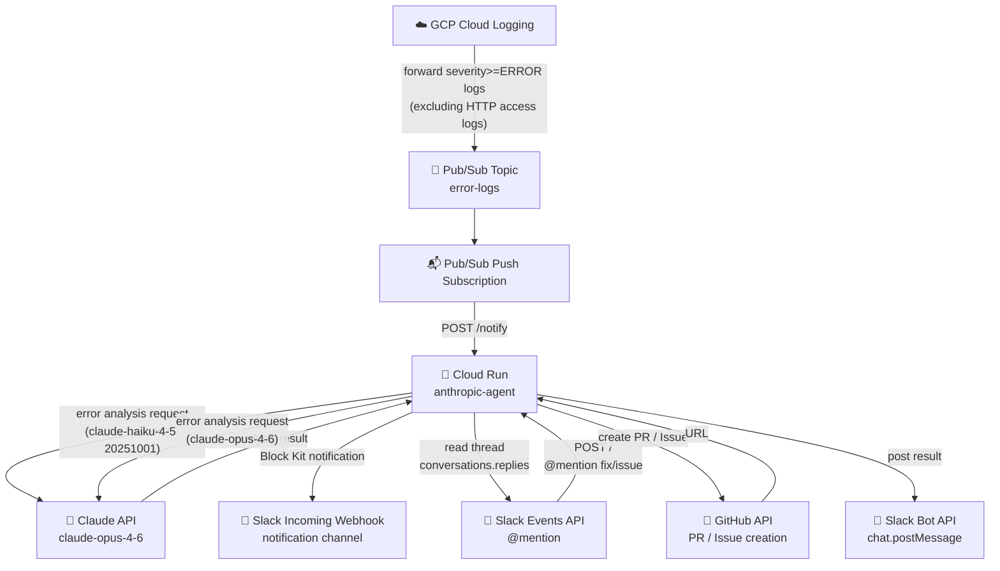

# anthropic-agent

A Cloud Run service that detects GCP error logs, analyzes them with Claude, and sends Slack notifications.
Responds to Slack @mentions to automatically create GitHub PRs and Issues.

## Models

| Use case | Model |
|----------|-------|
| Error notification analysis (`/notify`) | `claude-haiku-4-5-20251001` |
| `@mention fix` / `@mention issue` commands | `claude-opus-4-6` |

## Endpoints

| Path | Purpose |
|------|---------|
| `POST /notify` | Receives Pub/Sub Push subscription messages |
| `POST /` | Receives Slack Events API events |

## Architecture



## Flow

### 1. Error Notification (Pub/Sub → Slack)

```
GCP Cloud Logging
  └─ detects severity>=ERROR log
      ※ HTTP access logs (run.googleapis.com/requests) are excluded
         to prevent Slackbot-LinkExpanding loop (see Loop Prevention below)
  └─ forwards to Pub/Sub topic: error-logs
     └─ Push subscription calls POST /notify
        └─ resolves repository from REPO_MAP by service name
           └─ unregistered services are skipped (logged only)
        └─ analyzes error with Claude (claude-haiku-4-5-20251001)
        └─ sends Block Kit notification via Slack Webhook
           ├─ Project ID / GitHub repository link
           ├─ Service name
           ├─ Error message (with method/path/query context)
           ├─ View in Cloud Logging button
           └─ AI analysis result
```

### 2. Auto-create GitHub PR (`@mention fix`)

```
Slack: @mention fix
  └─ Slack Events API → POST /
     └─ fetch thread messages
        └─ analyze error with Claude (claude-opus-4-6, evaluate should_create_pr)
           └─ if should_create_pr=true
              └─ GitHub API: create branch → update file → create PR
                 └─ post link to Slack thread
```

### 3. Create GitHub Issue (`@mention issue`)

```
Slack: @mention issue
  └─ Slack Events API → POST /
     └─ fetch thread messages
        └─ analyze error with Claude (claude-opus-4-6)
           └─ GitHub API: create Issue
              └─ post link to Slack thread
```

## Loop Prevention

Slack's internal security bot (`Slackbot-LinkExpanding`) automatically fetches URLs found in messages.
If the error message contains a Cloud Run service URL, this fetch causes an HTTP 500 → Cloud Run logs it → triggers another notification → infinite loop.

**Solution**: The Cloud Logging sink filter excludes `run.googleapis.com/requests` (HTTP access logs).
Only application-level logs (stdout/stderr from the app itself) are forwarded to Pub/Sub.

```
log_filter = "severity>=ERROR
  AND logName!=\"projects/.../logs/run.googleapis.com%2Frequests\"
  AND resource.labels.service_name!=\"anthropic-agent\"
  ..."
```

## Environment Variables

| Variable | Required | Description |
|----------|----------|-------------|
| `ANTHROPIC_API_KEY` | ✅ | Claude API key |
| `SLACK_WEBHOOK_URL` | ✅ | Incoming Webhook URL for error notifications |
| `SLACK_BOT_TOKEN` | ✅ | Slack Bot Token (`xoxb-...`) |
| `SLACK_SIGNING_SECRET` | recommended | Secret for verifying Slack request signatures |
| `GITHUB_TOKEN` | ✅ | GitHub Personal Access Token |
| `GITHUB_USER` | ✅ | GitHub owner name (e.g. `your-github-username`) |
| `REPO_MAP` | ✅ | Service name to repository mapping (e.g. `example-api=example,foo-svc=foo`) |
| `PROJECT_ID` | ✅ | GCP project ID |
| `BOT_NAME` | ✅ | Slack bot mention name (e.g. `@Claude AI`) |

## File Structure

```
services/anthropic_agent/
├── main.go      # Entry point and HTTP routing
├── pubsub.go    # Pub/Sub handler, error analysis, Slack notification
├── slack.go     # Slack Events handler, mention processing
├── github.go    # GitHub API (PR/Issue creation, repo resolution)
├── claude.go    # Claude API calls
├── util.go      # Shared utilities
├── Dockerfile
├── go.mod
└── go.sum
```
